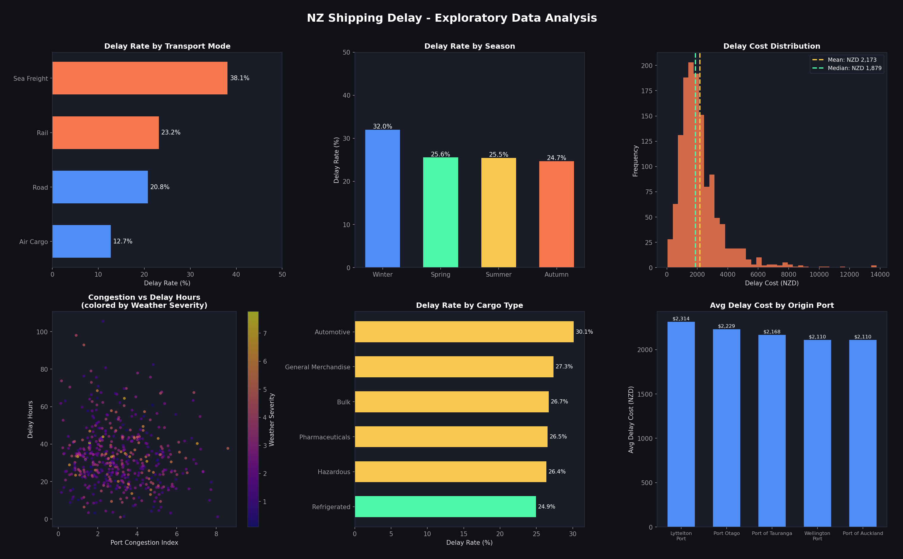
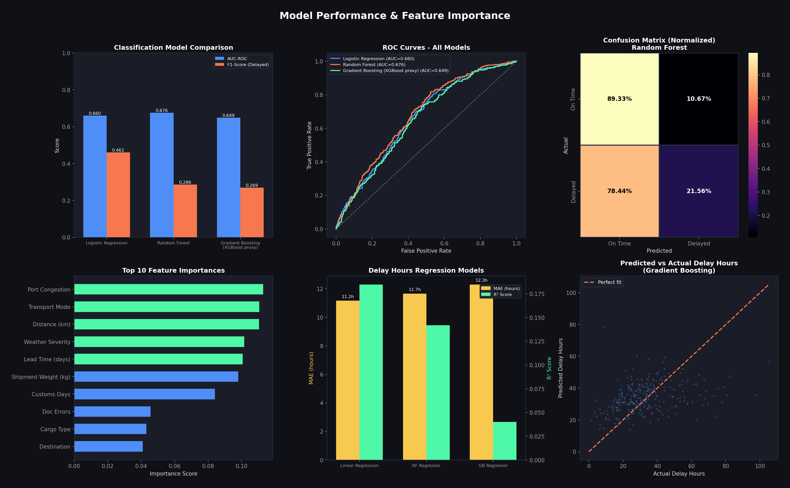
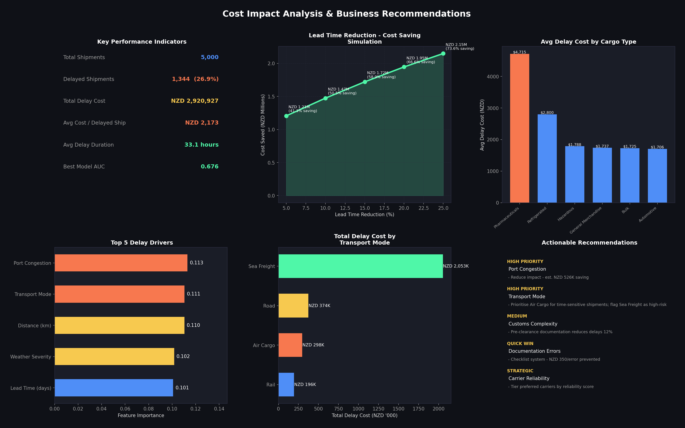

# Shipping Delay & Cost Impact Analysis
### New Zealand Logistics - Operational Risk Management

   

---

## Executive Summary

Shipping delays are a significant operational risk across NZ sea freight, air cargo, and road logistics - driving up costs and eroding service levels. This project builds a machine learning pipeline to **predict delivery delays before they occur** and quantify their financial impact, enabling logistics and operations teams to prioritise the interventions with the highest ROI.

**Key Finding:** 26.9% of NZ shipments are delayed, costing an estimated NZD 2.92M in operational overhead. A 10% reduction in lead time variability could save up to NZD 1.47M annually - equivalent to eliminating roughly 320 high-cost delay incidents per year.

---

## Business Problem

| Problem | Impact |
|---|---|
| Unpredictable delivery delays | Port congestion, missed SLAs |
| High cost per delayed shipment | Avg ~NZD 2,173 per incident |
| No proactive risk signal | Teams react instead of prevent |

**Goal:** Build a data-driven early warning system that flags high-risk shipments before dispatch, and identifies the top operational levers to reduce delay costs.

---

## Dataset

Synthetic dataset of 5,000 NZ shipments designed to reflect real logistics patterns across NZ ports and freight routes.

| Feature | Description |
|---|---|
| `transport_mode` | Sea Freight, Air Cargo, Road, Rail |
| `origin_port` | Port of Auckland, Port of Tauranga, Lyttelton Port, Port Otago, Wellington Port |
| `cargo_type` | General Merchandise, Refrigerated, Hazardous, Bulk, Automotive, Pharmaceuticals |
| `port_congestion_idx` | Real-time congestion score (0-10) |
| `weather_severity` | Weather disruption index (0-10) |
| `carrier_reliability` | High / Medium / Low |
| `customs_complexity` | Simple / Moderate / Complex |
| `documentation_errors` | Count of errors per shipment |
| `delay_hours` | Actual delay duration - regression target |
| `is_delayed` | Binary delay flag - classification target |

**Note on data:** Synthetic dataset designed to simulate realistic operational patterns in NZ freight logistics. See Assumptions section below for full details.

---

## Assumptions & Sensitivity Analysis

### Cost Assumptions

| Cost Component | Base Assumption | Source Basis |
|---|---|---|
| Operational overhead | NZD 45/hr | NZ logistics industry benchmark |
| Cold-chain penalty | +NZD 30/hr | Refrigerated transport surcharge estimate |
| Pharmaceuticals penalty | +NZD 80/hr | High-value cargo handling estimate |
| Holding cost | 3% of shipment value/day | Standard inventory holding rate |
| Documentation error surcharge | NZD 350/error | Admin + re-processing cost estimate |

### Sensitivity Analysis - Total Delay Cost

| Overhead Rate | Total Delay Cost | Change vs Base |
|---|---|---|
| NZD 30/hr | NZD 1.90M | -33% |
| **NZD 45/hr (base)** | **NZD 2.92M** | **-** |
| NZD 60/hr | NZD 3.80M | +33% |

### Sensitivity Analysis - Cost Saving (10% Lead Time Reduction)

| Overhead Rate | Estimated Saving | Change vs Base |
|---|---|---|
| NZD 30/hr | NZD 0.96M | -33% |
| **NZD 45/hr (base)** | **NZD 1.47M** | **-** |
| NZD 60/hr | NZD 1.92M | +33% |

**Interpretation:** Even under the most conservative assumption (NZD 30/hr), a 10% lead time reduction yields nearly NZD 1M in annual savings - confirming the business case holds across a wide range of cost scenarios.

---

## Methodology

### 1. Exploratory Data Analysis
- Delay rate breakdown by transport mode, season, cargo type, and origin port
- Cost distribution analysis across shipment segments
- Correlation between port congestion, weather severity, and delay duration

### 2. Classification - Will this shipment be delayed?

| Model | AUC-ROC | F1 (Delayed) | Recall | Notes |
|---|---|---|---|---|
| Logistic Regression | 0.660 | 0.461 | 0.602 | Baseline, interpretable |
| **Random Forest** | **0.676** | **0.286** | **0.208** | Best AUC - selected |
| Gradient Boosting (sklearn) | 0.649 | 0.269 | 0.208 | Similar to RF |

**Why Random Forest?** All models were trained with `class_weight="balanced"` to address class imbalance (73% on-time vs 27% delayed). Random Forest achieved the highest AUC-ROC (0.676), making it the most reliable model for ranking shipments by delay risk. While Logistic Regression showed higher recall, AUC is the primary metric for an early warning system where consistent risk discrimination across the full score range matters most. Threshold tuning can be applied to increase recall at the expense of precision, depending on the operational risk tolerance of the deployment context. In operational settings, the model would be deployed with a probability threshold aligned to the organisation's tolerance for missed delays versus false alerts.

### 3. Regression - How many hours will it be delayed?

| Model | MAE | R² |
|---|---|---|
| Linear Regression | 11.16h | 0.185 |
| Random Forest | 11.66h | 0.142 |
| Gradient Boosting | 12.30h | 0.040 |

*The low R² reflects inherent uncertainty in operational delays driven by external factors not fully captured in the dataset. The model provides directional insight rather than precise hour-level forecasting, which is sufficient for strategic planning purposes.*

---

## Key Results & Recommended Actions

### What should operations teams do differently?

| Priority | Driver | Importance | Recommended Action |
|---|---|---|---|
| High | Port Congestion | 0.113 | Pre-departure congestion monitoring. Avoid peak dispatch windows (Mon AM, Fri PM) |
| High | Transport Mode | 0.111 | Prioritise Air Cargo for time-sensitive shipments; flag Sea Freight as high-risk |
| Medium | Distance | 0.110 | Apply +1 day lead time buffer for shipments >1,500km |
| Medium | Weather Severity | 0.102 | Trigger weather-based routing protocol when severity index >7 |
| Quick Win | Lead Time (days) | 0.101 | Tighten lead time planning windows to reduce variability |

**Bottom line:** Addressing the top 2 drivers alone (port congestion + transport mode selection) could reduce the delay rate from 26.9% to an estimated 19-21% (based on scenario modelling), saving NZD 800K-1.1M annually without capital investment.

### Cost Saving Simulation

| Lead Time Reduction | Estimated Annual Saving |
|---|---|
| 5% | NZD ~740K |
| 10% | NZD 1.47M |
| 20% | NZD 1.95M |

---

## Business Implications

The analysis demonstrates how delay prediction and cost impact modeling can support operational planning, route optimisation, and cost control strategies in logistics environments. The classifier output can serve as a pre-dispatch risk score, enabling teams to intervene before delays occur rather than reacting after the fact. Cost simulation results provide a quantifiable business case for investment in congestion monitoring and carrier reliability programmes.

---

## Visualisations

### EDA - Delay Patterns


### Model Performance


### Cost Impact & Recommendations


---

## How to Run

```bash
# Clone the repo
git clone https://github.com/shindatax/nz-shipping-delay-analysis.git
cd nz-shipping-delay-analysis

# Install dependencies
pip install -r requirements.txt

# Run the full analysis
python shipping_delay_analysis.py
```

Output files will be saved to `outputs/` and `data/` directories automatically.

---

## Project Structure

```
nz-shipping-delay-analysis/
│
├── shipping_delay_analysis.py   # Main analysis pipeline
├── requirements.txt             # Python dependencies
├── .gitignore
├── data/
│   └── nz_shipping_data.csv     # Synthetic dataset (5,000 shipments)
├── outputs/
│   ├── 01_eda.png               # EDA visualisations
│   ├── 02_model_results.png     # Model performance charts
│   └── 03_cost_impact.png       # Cost impact & recommendations
├── sql/
│   ├── 01_create_tables.sql     # Database schema
│   ├── 02_kpi_queries.sql       # Operational KPI queries
│   └── 03_feature_dataset.sql   # ML feature engineering views
└── README.md
```

---

## SQL Queries

The `/sql` folder contains production-ready queries for operational reporting, written for **PostgreSQL**:

- `01_create_tables.sql` - Database schema with indexes
- `02_kpi_queries.sql` - On-time rate, delay rate by port, cost by cargo type, seasonal patterns, carrier reliability impact
- `03_feature_dataset.sql` - ML-ready feature view + high-risk shipment flagging view

---

## Business Relevance

This framework applies to operational challenges common across NZ logistics:

- **Port Operations** - Congestion risk monitoring and container throughput planning
- **Air & Sea Cargo** - Delay prediction and scheduling optimisation
- **Freight Forwarders** - SLA risk management and carrier performance management
- **Importers & Exporters** - Lead time variability and cost impact quantification

---

## Tech Stack

`SQL` `Python` `pandas` `NumPy` `scikit-learn` `Matplotlib` `Seaborn` `GitHub Pages`
